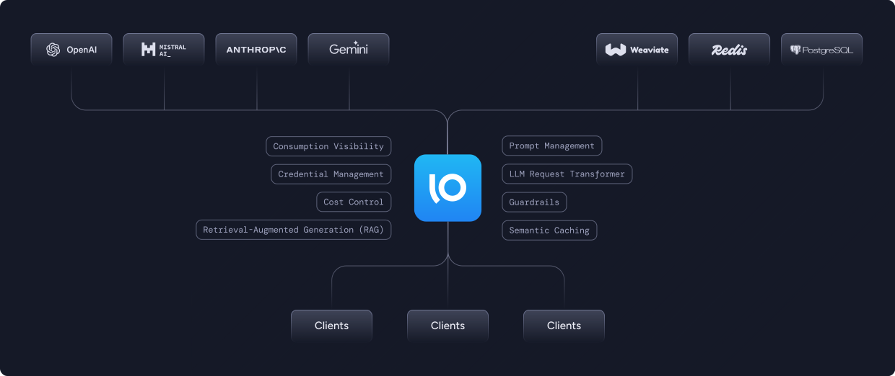

# Note on migration to solo-field-installer repo
This repo still works as a standalone installer for Gloo AI Gateway with demos, but I have ported all of this work to [solo-field-installer](https://github.com/solo-io/solo-field-installer) to maintain everything in one place

Here are the demos, in each README you will see instructions on how to set up the environment and run the demo
[https://github.com/solo-io/solo-field-installer/tree/main/demos/ai-gateway](https://github.com/solo-io/solo-field-installer/tree/main/demos/ai-gateway)

# Gloo AI Gateway Field Demo



### Setup the Environment
```bash
./install-base.sh
```

### Navigate to the demo of your choice
```bash
cd demos
ls
```

### Run the Demo
```bash
./demo-script.sh
```

### asciinema
Recordings of these demos using asciinema can be found at the following links:

- [aigw-lb-failover-demo](https://asciinema.org/a/QTiUvWjyk6Tu7HQ0duevMOaTm)
- [aigw-auth-and-rl-demo](https://asciinema.org/a/0urpIzs8rLlDz4Wyba1a2jV6O)
- [aigw-semantic-cache-demo](https://asciinema.org/a/EDBWEFCLrGQy9su7wSxWGu1kb)
- [aigw-prompt-management-demo](https://asciinema.org/a/EqlEvIG6xMx9esZiquiMw2sI5)
